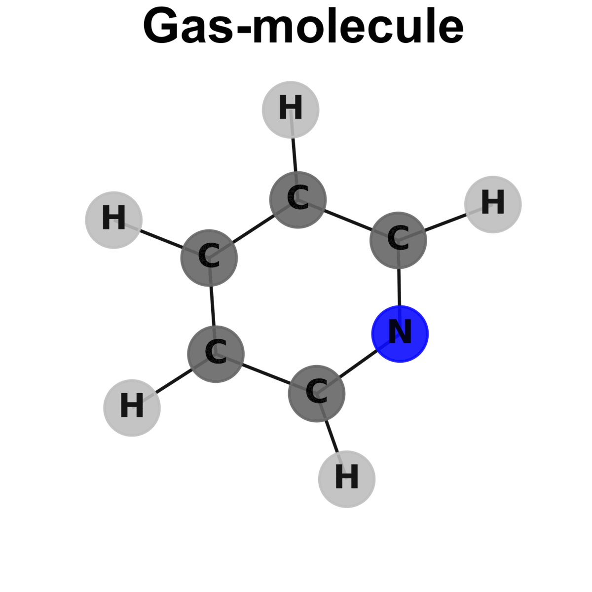
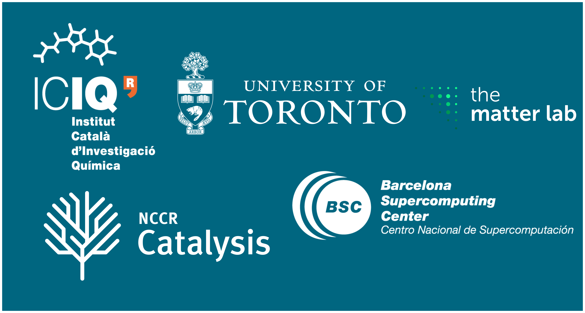

# Fast Evaluation of the Adsorption Energy of Organic Molecules on Metals via Graph Neural Networks

    

This is the repository of the framework related to the work "Fast Evaluation of the Adsorption Energy of Organic Molecules on Metals via Graph Neural Networks". The Graph Neural Networks (GNNs) developed within this framework allow the fast prediction of the DFT ground state energy of the following systems:

- All gas-phase closed-shell molecules containing C, H, O, N and S.
- Adsorption systems: Same molecules mentioned above on the following 12 metals: Ag, Au, Cd, Cu, Ir, Ni, Os, Pd, Pt, Rh, Ru, Zn.

The framework is built on top of [PyTorch](https://pytorch.org/) and [PyTorch Geometric](https://pytorch-geometric.readthedocs.io/en/latest/index.html).
## Installation

1. Clone the repo from GitLab. Open a terminal and use the following command:  

    `git clone https://gitlab.com/iciq-tcc/nlopez-group/gnn_eads.git`  
    
    You should now have the repo ``gnn_eads`` in your current directory.  

2. Create a conda environment. Enter the repo: You should find the file `GNN_env.txt`: It contains all the information about the packages needed to create the environment for the GNN framework. Choose a name for the new environment (we will use `GNN` here) and type the command:  

    `conda create --name GNN --file GNN_env.txt`  
    
    Check that you have created your new environment by typing `conda env list`: A list with all your environments appear, together with the newly created `GNN`. Activate it with `conda activate GNN` (you will see the name of the current active environment within parentheses on the left of the terminal).  

3. Install [PyRDTP](https://gitlab.com/iciq-tcc/nlopez-group/pyrdtp), a package at the base of the framework. Clone the repo in the existing `gnn_eads` base directory (i.e., be sure to be in `gnn_eads` before executing the following command) and install it with pip:  

    `git clone --branch experimental https://gitlab.com/iciq-tcc/nlopez-group/pyrdtp.git`  
    `pip install pyrdtp`

    To check the correctness of the installation, type `conda list` and check out the presence of pyrdtp in the list.

<!-- 4. Create the following empty folders in the repo: 

    `mkdir Data Models Hyperparameter_Optimization`

    As the names suggest, `Data` will store the DFT datasets used to train the GNNs in case you will work in *training mode* (see below), while `Models` will contain the different GNN models stored in [Zenodo](https://www.zenodo.org/) if you choose to work in *inference mode* (see below), or the models you will create if you work in training mode otherwise. `Hyperparameter_Optimization` will store the results of the tuning process. -->

4. Download the raw DFT datasets: The FG-dataset must be stored in the folder `Data`. **N.B. The Datasets will remain on embargo until final publication. Once published, the data will be available both in iochem-BD and here**.

<!-- 5. Download the GNN models from Zenodo: They must be stored in the folder `Models`. -->

Done! In theory now everything is set up to start playing with the GNN framework!

## Usage

You have two possible choices for interacting with the GNN framework:

- **Inference mode**: Most likely, you are a curious person and want to probe the performance of the GNN models compared to your DFT simulations. In this case, you will test the pre-trained models developed by us, without going deeper in the details behind the models' generation process and without accessing the DFT data used to train them. 

- **Training mode**: You will go through all the steps defined in the workflow for the GNN model generation process. In this case you will need the raw DFT datasets for training the GNN. Within this mode, you can train your own models with the preferred hyperparameter setting and model architecture, or, if you have enough computational resources, you can perform hyperparameter tuning with the workflow based on [Ray Tune](https://docs.ray.io/en/latest/tune/index.html). 
**N.B. This mode is unavailable until final publication, as data are on embargo.**

### Inference mode

Within this mode, you can opt among two different options:

1. You already performed some DFT calculations with VASP and want to compare the performance of the GNN models with the ground-truth provided by your data. In this case, the main scripts and files you will work with are `GNNvsDFT.ipynb` and `GNNvsDFT.ipynb`.

2. You have no DFT data for a specific system and want to get an estimation from our trained Graph Neural Networks. In this case, you will play with `interactive_graph_creator.py`, a GNN interface connected to the [ChemSpider](https://www.chemspider.com) database to help you draw the graph related to your specific case, providing the ground state energy of the system and the adsorption energy. See the demos in the "Media" directory. 

    `python interactive_graph_creator.py`
### Training mode

The DFT datasets are stored in [ioChem-BD](), and the needed samples for the GNN are in the FG_dataset folder.
Within this mode, you can choose among two available ways to use the GNN:

1. Perform a model training with your own model architecture and hyperparameter setting: To do so, follow the instructions provided in the Jupyter notebook `train_GNN.ipynb`, or directly run the script `train_GNN.py`. The hyperparameter settings must be provided via a .toml file. Once created, type: 

    `python train_GNN.py -i hyper_config.toml`

    To check the documentation of the script, type `python train_GNN.py -help`.
2. Perform a hyperparameter optimization using the Asynchronous Successive Halving (ASHA) scheduler provided by Ray Tune. You can study the effect of all hyperparameters on the final model performance (e.g., learning rate, loss function, epochs) and you can also test different model architecture automatically, without the need of manually defining the architecture. The script you have to use in this case is `hypopt_GNN.py`. For this script, the hyperparameter space must be defined in the script before running it. For example, to launch a hyperparameter optimization called `hypopt_test` with 2000 trials, each one with a grace period of 15 epochs and providing 0.5 GPUs for each trial (e.g., two trials per GPU), type:

    `python hypopt_GNN.py -o hypopt_test -s 2000 -gr 15 -gpt 0.5`

# Authors

Santiago Morandi, Ph.D. Student, López group (ICIQ, Spain)  
Sergio Pablo-García, Ph.D. Student, López Group (ICIQ, Spain), now postdoc in the Aspuru-Guzik group (UoT, Canada)
# Contributors

Zarko Ivkovic, M.Sc. Student, University of Barcelona, ICIQ Summer Fellow 2022; involved in the creation of the DFT dataset and interface testing.

# License

[MIT License](https://gitlab.com/iciq-tcc/nlopez-group/gnn_eads/-/blob/master/LICENSE)
# Support 

In case you need help or are interested in contributing, feel free to contact us sending an e-mail to smorandi@iciq.es

# Acknowledgements

    

