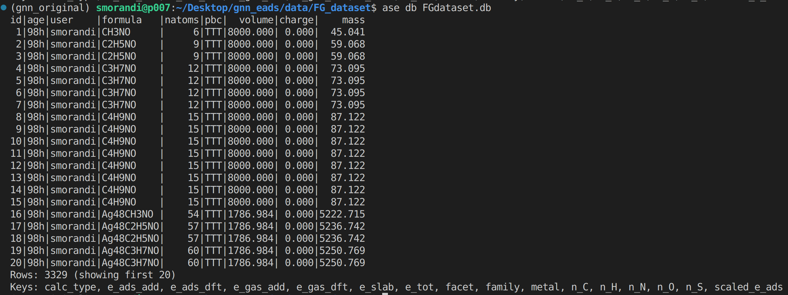
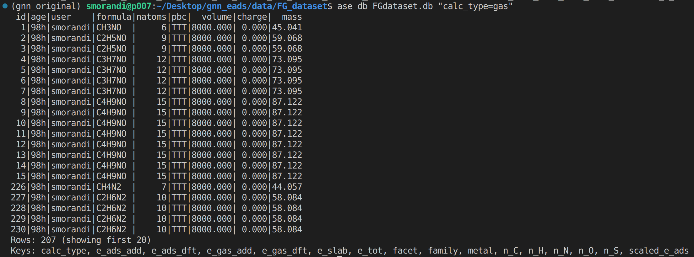
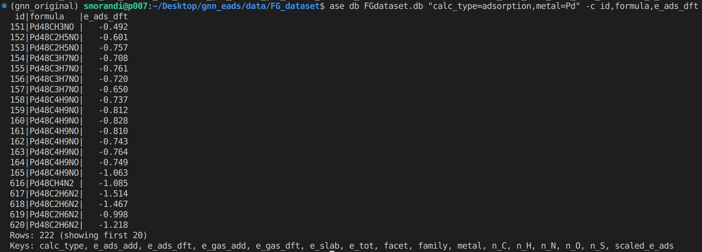
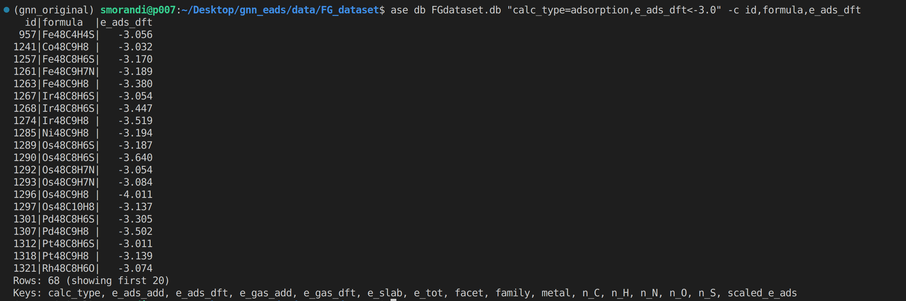

# Accessing the ASE database for the FG-dataset

The DFT raw data used for developing GAME-Net are stored in the database framework provided by the Atomic Simulation Environment ([ASE](https://wiki.fysik.dtu.dk/ase/)) Python package.
Each DFT calculation is stored as an `ase.atoms.Atoms` object, containing the main information typically retrieved from DFT.
The dataset file is `FGdataset.db`. It can be accessed from the command line and from Python.

## Database keys

default keys
- `id`: Sample identifier in the database.
- `age`: Elapsed time from when the sample has been added to the database.
- `user`: Data author username.
- `formula`: Brute formula of the system contained in the Atoms object.
- `natoms`: Total number of atoms.
- `pbc`: Whether periodic boundary conditions are applied in the x/y/z directions.
- `volume`: Cell volume in Angstrom^3.
- `charge`: Net charge of the system.
- `mass`: Total mass of the system (au).

user-defined keys (defined for all items)

- `calc_type`: Calculation type: "adsorption"/"gas"/"slab".
- `family`: Chemical family of the sample, depending on the nature of the molecule. 
- `metal`: Chemical symbol of the metal defining the catalyst surface. "N/A" if "calc_type" is "gas".
- `facet`: Exposed facet of the catalyst surface. (e.g. "fcc(111)) "N/A" if "calc_type" is "gas".
- `e_tot`: Total energy of the DFT-optimized system in eV.
- `e_slab`: Slab energy in eV. "N/A" if "calc_type" is "gas".
- `e_gas_dft`: Molecule energy in eV retrieved from direct DFT optimization.
- `e_gas_add`: Molecule energy in eV computed using a simple additivity function using for each chemical element the energy from closed-shell reference molecules.
- `e_ads_dft`: Adsorption energy of the system computed by subtracting the DFT-computed molecule energy.
- `e_ads_add`: Adsorption energy of the system computed by subtracting the additivity computed molecule energy.
- `scaled_e_ads`: Target of the original GAME-Net implementation in eV, defined as `e_tot`-`e_slab`.
- `n_C`: Number of C atoms in the molecule.
- `n_H`: Number of H atoms in the molecule.
- `n_O`: Number of O atoms in the molecule.
- `n_N`: Number of N atoms in the molecule.
- `n_S`: Number of S atoms in the molecule.

## Available targets for ML purposes

The provided `FG_dataset.db` provides three possible targets for Machine Learning purposes:

1) `e_ads_dft`, the DFT adsorption energy, defined as: 


    $$E_{ads}^{DFT} = E_{tot}^{DFT} - E_{slab}^{DFT} - E_{molecule}^{DFT}$$

    where $E_{tot}^{DFT}$ is the ground state energy of the total adsorption system (adsorbed molecule+surface), $E_{slab}^{DFT}$ the energy of the empty surface slab, and $E_{molecule}^{DFT}$ is the molecule energy in gas-phase. All the three values are computed directly with DFT. The values are reported in electronVolt (eV). This value is available only for systems representing adsorbed closed-shell molecules. For systems in gas phase, empty slabs, and adsorbed open-shell fragments (radicals), this value is not available in the database and their entry is `"N/A"`.

2) `e_ads_add`, the additivity-based adsorption energy, defined as:

    $$ E_{ads}^{add} = E_{tot}^{DFT} - E_{slab}^{DFT} - E_{molecule}^{add}$$

    where the only difference with `e_ads_dft` is in the definition of the molecule energy. $E_{molecule}^{add}$ is computed using reference energy values for each element (e.g., C, H, O, N, S) from reference closed-shell molecules computed with DFT: CO2 for C, H2 for H, H2O for O, NH3 for N, and H2S for S. (e.g., $E_{ethylene, C2H4}^{add}=2E_{C} + 4E_{H}$). 
    This value is available for all adsorption systems representing both closed- and open-shell molecules. The values are reported in electronVolt (eV).

3) `scaled_e_ads`, the scaled adsorption energy, defined as: 

    $$E_{ads}^{scaled} = E_{tot}^{DFT} - E_{slab}^{DFT}$$

    where the only difference with the previous targets is the absence of the molecule energy term. This value represents the energy of the molecule plus the energy perturbation due to the interaction with the catalyst surface. This values is available for all items. Its value is reported in electronVolt (eV).


## Querying from the command line

- Visual inspection (database size, default and user-defined keys):

```prompt
ase db FGdataset.db
```

<p align="center">
    
</p>

- Print items satisfying a specific criterion (e.g., only gas-phase calculations)

```prompt
ase db FGdataset.db "calc_type=gas"
```

<p align="center">
    
</p>

- Print items satisfying a specific creiterion and display specific keys (e.g. adsorption systems containing Pd, print their id, formula, and adsorption energy)

```prompt
ase db FGdataset.db "calc_type=adsorption,metal=Pd" -c id,formula,e_ads_dft
```

<p align="center">
    
</p>

- Print items representing adsorption systems whose adsorption energy is smaller than -3 eV and print their id, formula and adsorption energy

```prompt
ase db FGdataset.db "calc_type=adsorption,e_ads_dft<-3.0" -c id,formula,e_ads_dft
```

<p align="center">
    
</p>

- To display all the items:

```prompt
ase db FGdataset.db --limit=0
```

- To display all the columns defined in the database (e.g., the first 120 items): 

```prompt
ase db FGdataset.db c ++ --limit=120
```

- To delete specific items based ona specific key (e.g., delete all items whose family is "aromatics"):

```prompt
ase db --delete FGdataset.db "family=aromatics"
```

## Accessing the ASE database objects with Python

The most versatile way to access items in the ASE database is by converting them as `ase.atoms.Atoms` object. In order to do so, two steps are needed: connecting the database, and getting the items as Atoms objects via the .toatoms() method.

```python
from ase.db import connect

db = connect('FGdataset.db')  # Connect ASE *.db database

for row in db.select('calc_type=adsorption,metal=Pd'): # Select Adsorption systems on Pd
    atoms_object = row.toatoms()
    calc_type = row.get("calc_type")
    formula = row.get("formula")
    ...
```


