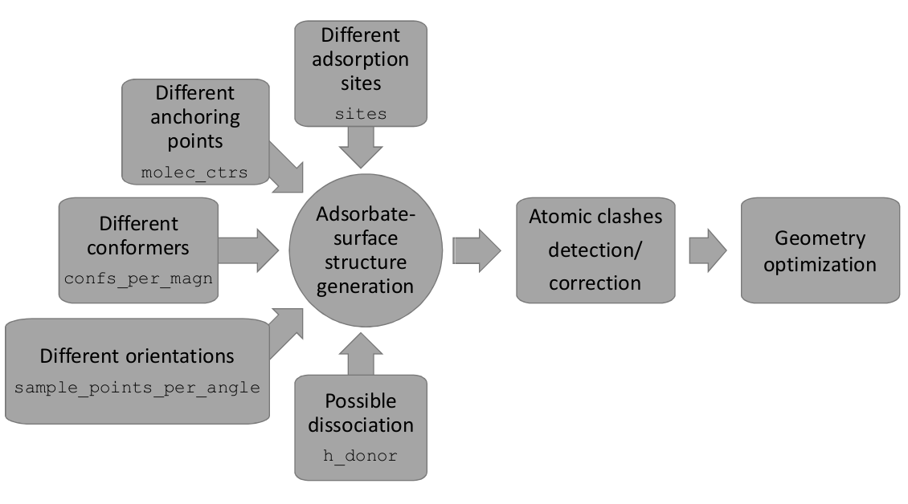
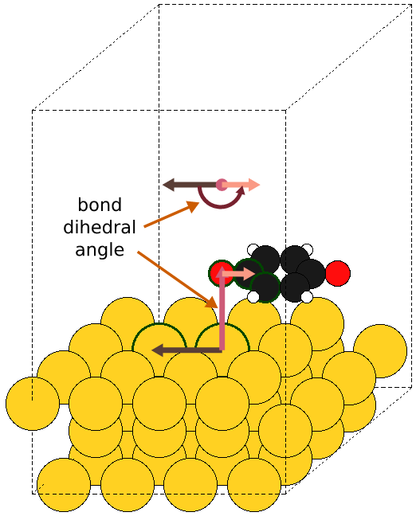
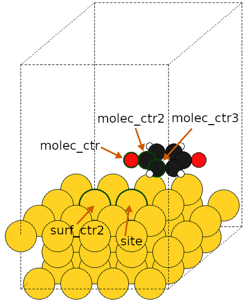

Input file reference manual
===========================

DockOnSurf execution is controlled by the edition of an input file. In this
file, all the mandatory and optional parameters are specified using a keyword
= value pair. An example of such file is provided in
``dockonsurf/examples/dockonsurf.inp``.

Keywords must be specified under one of the four existing
sections: :ref:`global`, :ref:`isolated`, :ref:`screening` and :ref:`refinement`
, the last three corresponding to the stages DockOnSurf consist on. Keywords can
beclassified in three categories:

* *mandatory*, for which its value must always be provided (eg. **run_type**)
* *keyword-dependent*, for which specification is only mandatory depending on
  the value of another keyword (eg. **subm_script** keyword is mandatory if
  **batch_q_sys** has a value different than "False")
* *optional*, for which a default value is assigned when the keyword is not
  given any value (eg. **max_structures**).

Although none of the three stages is compulsory for a DockOnSurf execution, the
necessary keywords for each of the stages will be also considered as mandatory.
They are mandatory in the case of running such stage.

For some keywords, the use of more than one value is possible. In order to
separate such values, a whitespace (" "), a comma (",") or a semicolon (";") can
all be used. Some values need to be specified in groups (eg. each of the three
vectors of the cell matrix). In such case groups are defined by enclosing the
elements around parentheses-like characters: "()", "[]" or "{}". (eg. "(a1,
a2,a3) [b1 b2 b3] {c1;c2; c3}").

.. _global:

Global
^^^^^^
Parameters in this section have an effect on the entire DockOnSurf execution.

| **batch_q_sys** (*mandatory*): The scheduler managing the job submission in
  the computing center. If set to "False" DockOnSurf will perform a dry run,
  where all structures and the directory hierarchy will be created but no job
  will be submitted/run.
| Accepted values: "SGE", "LSF", "SLURM" or "False".

| **code** (*mandatory*): The program to carry out the geometry optimizations.
| Accepted values: "CP2K" or "VASP".

| **max_jobs** (*optional*): The maximum number of jobs in a certain status:
  running ("r"), pending/queued ("p" or "q"), or the sum of both ("rp" or "rq").
| Accepted values: positive integers together to the letters defining the
  status (eg. "7r", "5p" or "10r 5q 12rq"), or "False". Combination of different
  values is possible. Default value: False

| **pbc_cell** (*optional*): The cell to which Periodic Boundary conditions is
  going to be applied. It's used in the detection of collisions and dissociation
  of hydrogen atoms.
| Accepted values: The cell matrix: (a1 a2 a3) (b1 b2 b3) (c1 c2 c3) or
  "False". Default value: False

.. note:: When using VASP as code, the PBC cell must be provided either through
  the *pbc_cell* keyword or inside the coordinates file. (eg. POSCAR/CONTCAR)

| **potcar_dir** (*optional*): The path to the directory containing all the
  elements with their corresponding POTCAR files.
| Accepted values: The path of a directory (eg. /home/cmarti/potcars/) or
  "False". Default value: False

| **project_name** (*optional*): The name of the project. It will appear in the
  job names of the submitted calculations.
| Accepted values: all. Default value: *nothing*

| **run_type** (*mandatory*): Type of run that you want to perform.
  It will activate the execution of each of the different stages.
| Accepted values: Isolated, Screening, Refinement, Full = Isolated +
  Screening + Refinement, Adsorption = Screeng + Refinement. More than
  one value can be specified separated by (Isolated Screening

| **special_atoms** (*optional*): Non-standard atom types defined in the
 coordinates file together with the standard atom it is related to grouped
 inside parentheses.
| Accepted values: groups of parentheses containing each a couple of
  non-standard, standard chemical symbol. (eg. (Fe1 Fe) (Fe2 Fe) (O1 O)),
  or "False". Default value: False

| **subm_script** (*keyword-dependent*): The script for the job submission.
| Mandatory if *batch_q_sys* is not set to "False".
| Accepted values: The name/path of the file.

.. _isolated:

Isolated
^^^^^^^^
Parameters in this section have an effect on the Isolated stage.

| **isol_inp_file** (*mandatory*): The input file to be used for the chosen code
  in order to carry out the geometry optimization.
| Accepted values: The name/path of the file.

| **molec_file** (*mandatory*): The file containing the coordinates of the
  molecule. Accepted formats: see https://wiki.fysik.dtu.dk/ase/ase/io/io.html
| Accepted values: The name/path of the file.

| **num_conformers** (*optional*): The number of raw conformers to generate
  to later optimize. It is NOT the final number of structures to optimize its
  geometry.
| Accepted values: Positive integer. Typically among 100 and 10.000. Default
  value: 100

| **pre_opt** (*optional*): Which force field should be used to preoptimize the
  geometry of the generated conformers in order to correct configurations with
  unreasonable geometries.
| Accepted values: "MMFF", "UFF" or "False". Default value: MMFF

.. _screening:

Screening
^^^^^^^^^
Parameters in this section have an effect on the Screening stage.

| **adsorption_height** (*optional*): The height at which the adsorbate should
  be placed above the surface. Units: Ångstroms.
| Accepted values: Positive decimal number. Default Value: 2.5

| **collision_threshold** (*optional*): When detecting atomic clashes with the
  collision of spheres method, *collision_threshold* sets the  coefficient by
  which the covalent radius of each atom should be multiplied to get the sphere
  radius. When set to False the detection of atomic clashes with the collision
  of spheres method is not  carried out.
| Accepted values: Positive decimal number or "False". Default Value: False

.. warning:: If both, the *collision_threshold* and *min_coll_height* are set to
  "False", atomic clashes will NOT be checked.

| **confs_per_magn** (*optional*): The number of conformers to select per
  magnitude/quantity. It selects the conformers with most different values of
  the relevant quantity. If the moment of inertia (MOI) is chosen as magnitude,
  in **select_magns**,
  setting *confs_per_magn* to 1 picks the conformer with the largest value of
  moment of inertia, setting it to 2 picks the ones having the largest and the
  smallest, setting it to three, the largest, the median and the smallest, and
  so on. If energy is chosen as magnitude, setting *confs_per_magn* to 1 picks
  the most stable conformer (the smallest value of energy), setting it to 2
  picks the ones having the largest and the smallest, setting it to three, the
  largest, the median and the smallest, and so on.
| Accepted values: Positive integers.

| **exclude_ads_ctr** (*optional*): Whether to exclude the adsorption
  center/anchoring point from the atomic clashes detection.
| Accepted values: "True" or "False". Default Value: False

| **h_acceptor** (*optional*): Which atom types/indices of the surface act as
  proton acceptors.
| Accepted values: Chemical symbols of surface atoms, atom indices of surface
  atoms or "all". The use of more than one value is possible. Default Value:
  all.

| **h_donor** (*optional*): Which atom types/indices of the adsorbate act as
  proton donors. When set to "False" dissociation of protons is disabled.
| Accepted values: Chemical symbols of adsorbate atoms, atom indices of
  adsorbate atoms or "False". The use of more than one value is possible.
  Default Value: False.

| **max_helic_angle** (*optional*): The maximum value for the helicopter
  rotation of the adsorbate over the surface in degrees (see figure underneath).
| Accepted values: Positive decimal number. Default Value: 180.0.

| **max_structures** (*optional*): Maximum number of adsorbate-surface
  structures to generate. Structures are chosen randomly.
| Accepted values: Positive integer or "False".

.. warning:: When *max_structures* is set, structures are chosen randomly and
  reproducibility is not kept.

| **min_coll_height** (*optional*): The minimum height of atoms above the
  surface for them to be considered as non-colliding with the surface. It can
  only be used if the surface normal is one of the cartesian axes (both positive
  and negative).
  When set to False the detection of atomic clashes with the minimum height
  method is not carried out.
| Accepted values: Positive decimal number or "False". Default Value: 1.5

.. warning:: If both the *collision_threshold* and *min_coll_height* are set to
  "False", atomic clashes will NOT be checked.

| **molec_ctrs** (*mandatory*): The (groups of) atom indices in the
  adsorbate to be used as adsorption centers/anchoring points (ie. the centers
  to be placed right above the surface site). When a group of atom indices is
  defined by enclosing them inside parentheses-like characters ("()", "[]" or
  "{}"), the adsorption center/anchoring point is defined as the average of the
  atom's coordinates. It is useful to define π-modes like in ethylene or
  benzene.
| Accepted values: atom indices of the adsorbate atoms optionally grouped by
  enclosing them inside parentheses-like characters ("()", "[]" or "{}").
  The use of more than one value is possible.

| **molec_ctrs2** (*keyword-dependent*): The (groups of) atom indices in the
  adsorbate to be used as second centers (ie. the atoms used to define dihedral
  angles when using the internal set of angles). When a group of atom indices
  is defined by enclosing them inside parentheses-like characters ("()", "[]"
  or "{}"), the second center is defined as the average of the atom's
  coordinates.
| Mandatory if **set_angles** is set to "internal".
| Accepted values: atom indices of the adsorbate atoms optionally grouped by
  enclosing them inside parentheses-like characters ("()", "[]" or "{}").
  The number of second centers must be the same than the number of adsorption
  centers/anchoring points. Groups of indices count as 1.

| **molec_ctrs3** (*keyword-dependent*): The (groups of) atom indices in the
  adsorbate to be used as third centers (ie. the atoms used to define dihedral
  angles when using the internal set of angles). When a group of atom indices
  is defined by enclosing them inside parentheses-like characters ("()", "[]"
  or "{}"), the second center is defined as the average of the atom's
  coordinates.
| Mandatory if **set_angles** is set to "internal".
| Accepted values: atom indices of the adsorbate atoms optionally grouped by
  enclosing them inside parentheses-like characters ("()", "[]" or "{}").
  The number of third centers must be the same than the number of adsorption
  centers/anchoring points. Groups of indices count as 1.

| **sample_points_per_angle** (*optional*): Number of rotations to carry out, in
  the orientational sampling, per each of the three angle in the set. The total
  number of rotations generated is equal to :math:`n^3 - n(n-1)` where :math:`n`
  is the value set for *sample_points_per_angle*.
| Accepted values: Positive integers. Default Value: 3.

.. note:: All possible combinations of the three different angles are generated,
 leading to :math:`n^3` raw configurations. However, for both, the Euler (in its
 x-convention) and the internal set of angles, redundant configurations are
 generated with a dependence on the rotations per angle :math:`n`) equal to
 :math:`n(n-1)`: In the x-convention of Euler angles,
 :math:`(x, 0, 0) \equiv (0, 0 , x)`. In the internal angles, when the bond
 angle is flat, all the bond-dihedral angle rotations are ineffective. These
 redundant configurations generated both in the Euler and Internal angles are
 algorithmically filtered out.

| **screen_inp_file** (*mandatory*): The input file to be used for the chosen
  code in order to carry out the geometry optimization.
| Accepted values: The name/path of the file.

| **select_magns** (*mandatory*): Which magnitudes/quantities should be used to
  select the conformers generated at the :ref:`isolated` stage.
| Accepted values: "energy" or "MOI".

| **set_angles** (*mandatory*): Which set of angles must be used to perform the
  orientational sampling.
| Accepted values: "Internal" or "Euler"

| **sites** (*mandatory*): The (groups of) atom indices in the surface to be
  used as sites of adsorption (ie. where the adsorbate should be placed on the
  surface). When a group of atom indices is defined by enclosing them inside
  parentheses-like characters ("()", "[]" or "{}"), the adsorption site is
  defined as the average of the atom's coordinates. A single index represents an
  atop site, a group of two a bridge site and a group of three a hollow site.
| Accepted values: atom indices of the surface atoms optionally grouped, by
  enclosing them inside parentheses-like characters ("()", "[]" or "{}").
  The use of more than one value is possible.

| **surf_ctrs2** (*keyword-dependent*): The (groups of) atom indices in the
  surface to be used as second centers (ie. the atoms used to define dihedral
  angles when using the internal set of angles). When a group of atom indices is
  defined by enclosing them inside parentheses-like characters ("()", "[]" or
  "{}"), the surface second center is defined as the average of the atom's
  coordinates.
| Mandatory if **set_angles** is set to "internal".
| Accepted values: atom indices of the surface atoms optionally grouped, by
  enclosing them inside parentheses-like characters ("()", "[]" or "{}").
  The use of more than one value is possible.

| **surf_file** (*mandatory*): The coordinates file of the surface to be used
  for adsorption. Accepted formats: see
  https://wiki.fysik.dtu.dk/ase/ase/io/io.html
| Accepted values: The name/path of the file.

| **surf_normal_vect** (*optional*): The direction vector perpendicular to the
  surface. This is the direction towards where the adsorbate should be placed
  above the surface. The surface normal vector can be automatically guessed
  using the ASANN method. This is specially useful for stepped/kinked surfaces
  or nanoparticles, where the surface normal has to be defined locally.
| Accepted values: a three-dimensional vector (eg. "(1, -2, 4)"), "x", "y", "z",
  "-x", "-y", "-z" or "auto". Default value: auto.

| **use_molec_file** (*optional*): Instead of carrying out the :ref:`screening`
  stage using the molecules obtained in :ref:`isolated`. It uses a single
  conformer provided with a coordinates file.
| Accepted values: The name/path of the file. Default value: False.

.. _refinement:

Refinement
^^^^^^^^^^
Parameters in this section have an effect on the Refinement stage.

| **refine_inp_file** (*mandatory*): The input file to be used for the chosen
  code in order to carry out the geometry optimization.
| Accepted values: The name/path of the file.

| **energy_cutoff** (*optional*): The results from the screening are read and
  all structures corresponding to relative energies below a specified energy
  with respect to the most stable structure, are recomputed at a higher level of
  theory or accuracy. Units: eV.
| Accepted values: Positive decimal number. Default value: 0.5.

.. note:: The *energy_cutoff* must be chosen considering the approximate
  adsorption energy. For a given value several low-interacting species may fall
  within the energy cutoff, while for the most binding ones, only few of them
  may be selected for refinement.
